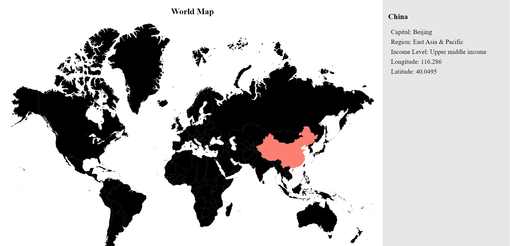
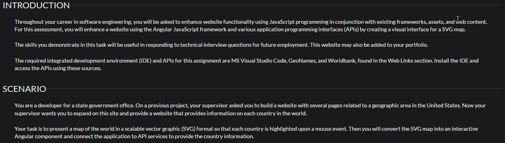

# World Map App

## Introduction
An interactive map application where users can highlight a country on a world map and retrieve information about the country via a public database's API.

### The Assignment:
I originally coded this website as an assignment for D280 while attending WGU:

## Using The App
You may test the web application by referring to the deployments in this repository.